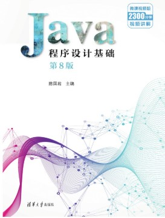
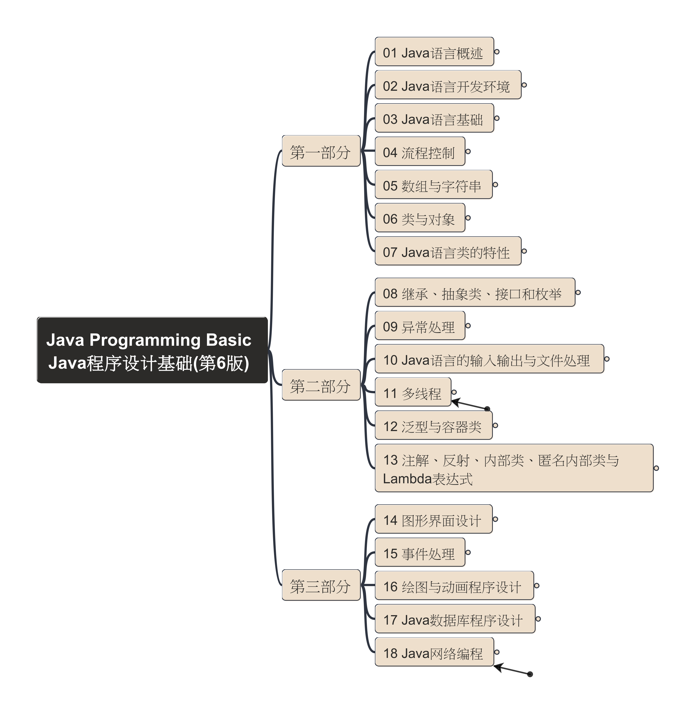
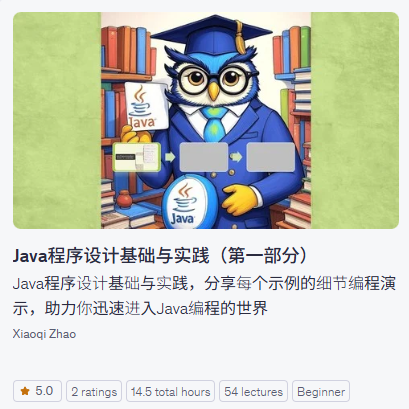
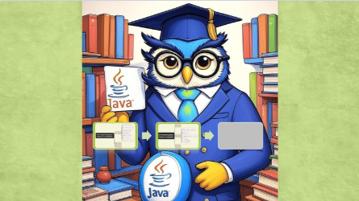
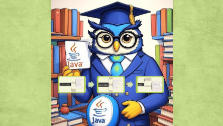

# Java Programming Basic

This folder contains the code for the book "Java程序设计基础（第6版）".

## 购买纸质书 最新版本：第8版 清华大学出版社

本课程参考微信读书中上架的第6版电子版本进行演示。

## 课程思维导图

## Udemy上发布的课程

| 第一部分（1~7章）| 第二部分（8~13章）| 第三部分（14~18章）|
| --- | --- | --- |
|  点击上图加入学习 |  第二部分，准备中... |  第三部分，敬请期待... |

## 课程视频分享（持续更新）

- YouTube: [播放列表](https://www.youtube.com/playlist?list=PL6DEHvciXKeVDrrfkTqZcSm4pEC6NMil2)
- BiliBili: [视频合集](https://space.bilibili.com/158390142/lists/4234811?type=season)
- DouYin 抖音: [视频合集](https://www.douyin.com/video/7437906178241219852)

---

欢迎在讨论区留言，感谢关注！